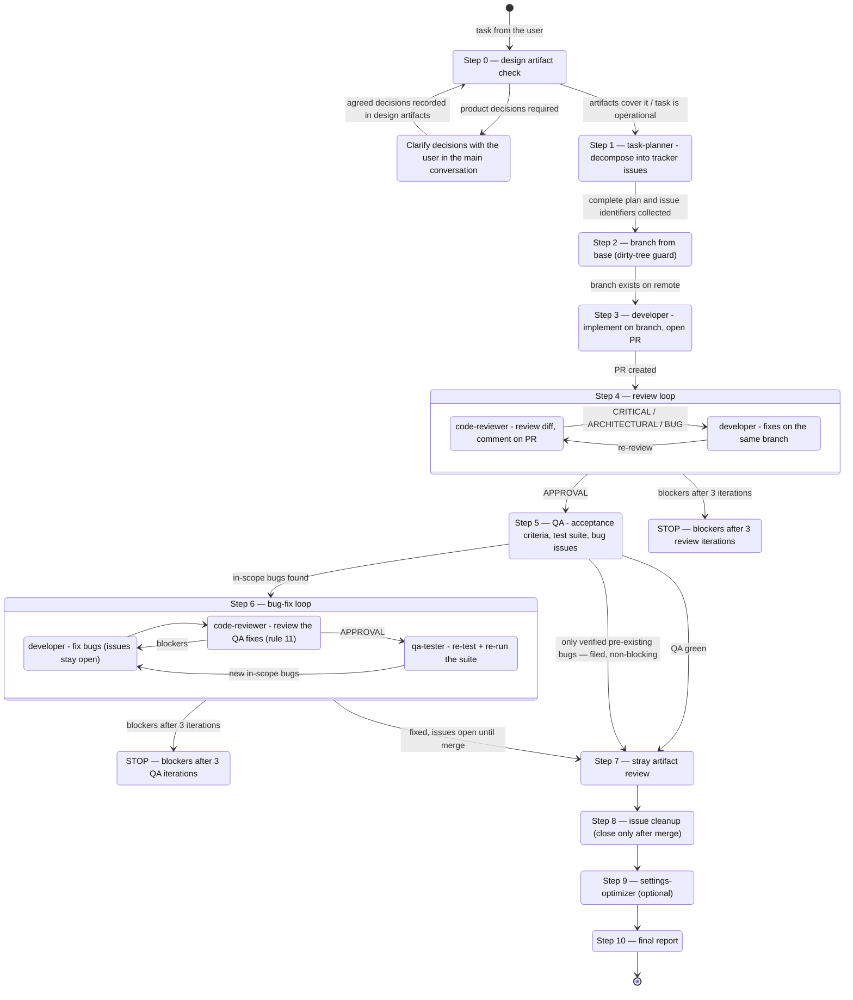

# Pipeline State Graph

The state machine described in [PIPELINE.md](PIPELINE.md). View it on GitHub or in a
renderer that supports Mermaid's
[`stateDiagram-v2` syntax](https://mermaid.js.org/syntax/stateDiagram.html).

## Legend

- **Every arrow is a transition** taken once the step's criterion is met. `stateDiagram-v2`
  cannot style individual transitions, so the distinctions live in the labels.
- **Verified pre-existing bugs** are filed as issues and included in the final report.
  If these are the only findings, continue to Step 7; artifact review, issue cleanup,
  and optional housekeeping still follow. Findings with unconfirmed origin remain
  blocking, as described in [Step 6](PIPELINE.md#step-6--bug-fix-loop).
- **Nested states** — the two loops. Step 4 is reviewer ⇄ developer. Step 6 is
  fix → review → re-test, and the review in the middle is rule 11: no code reaches a
  green QA verdict unreviewed.
- **Iteration guardrail** — both loops cap at 3 passes, then stop and escalate rather
  than grinding.
- **CLARIFY_DESIGN** — requirements are clarified in the main conversation before
  planning begins. Profile, planning, and working-tree problems can also pause the run;
  their checks are specified in [PIPELINE.md](PIPELINE.md). This graph shows real mode;
  the canonical [dry-run table](PIPELINE.md#dry-run-mode) replaces external artifacts
  with local ones.
