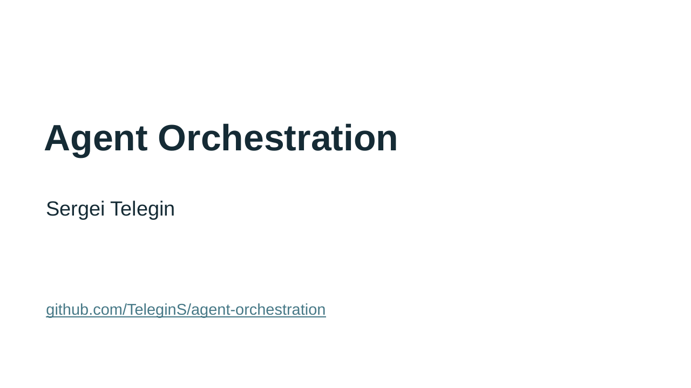

# English presentations for the Manychat meetup

Each deck contains 11 slides: an unnumbered title slide followed by 10 numbered content slides. The talk still targets 18 minutes of content and a 2-minute buffer. Audience questions follow the talk. Both use the saved GitHub screenshots. Text, tables and process diagrams remain editable in PowerPoint. Screenshots are embedded and use native slide cropping.

| Version | PowerPoint | PDF | Speaker notes |
|---|---|---|---|
| Detailed case study | [PPTX](manychat-case-study-en.pptx) | [PDF](manychat-case-study-en.pdf) | [English notes](manychat-case-study-en-speaker-notes.md) |
| Theory and practice | [PPTX](manychat-theory-and-practice-en.pptx) | [PDF](manychat-theory-and-practice-en.pdf) | [English notes](manychat-theory-and-practice-en-speaker-notes.md) |

The PowerPoint files contain the same speaker notes, timing cues and source references. PDFs contain the audience slides only. All screenshots work offline. Links to the original TrafficRulesApp sources require access to the private repository.

## Rehearsal checkpoints

| Version | Checkpoints |
|---|---|
| Detailed case study | 1:00 agent loop; 6:00 test-coverage case; 12:00 costs; 17:00 closing |
| Theory and practice | 7:00 personal pipeline; 9:00 test-coverage case; 13:00 costs; 17:00 closing |

Allow about 10–15 seconds for the title within the opening minute. The content-slide numbers used in the plans remain unchanged.

These are planned timings. Rehearse aloud with the slide changes before presenting. Preserve the two-minute buffer.

The example with 500 seconds illustrates the failure mechanism. It is not a measured result from the run. Cost figures exclude orchestrator tokens. The main pull request remained open when the screenshots were captured on 6 September 2026. Recheck its status before the meetup.

## Plans and evidence

- [Detailed case-study plan](../manychat-meetup-agent-orchestration-talk.md)
- [Theory-and-practice plan](../manychat-meetup-agent-orchestration-talk-theory-and-practice.md)
- [Screenshot catalog](../screenshots/README.md)
- [Local source copies](../resources/trafficrulesapp/README.md)

