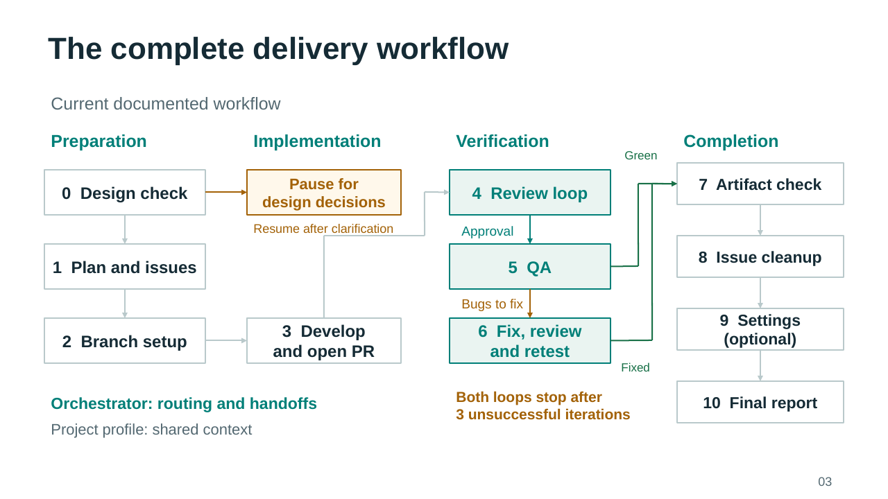
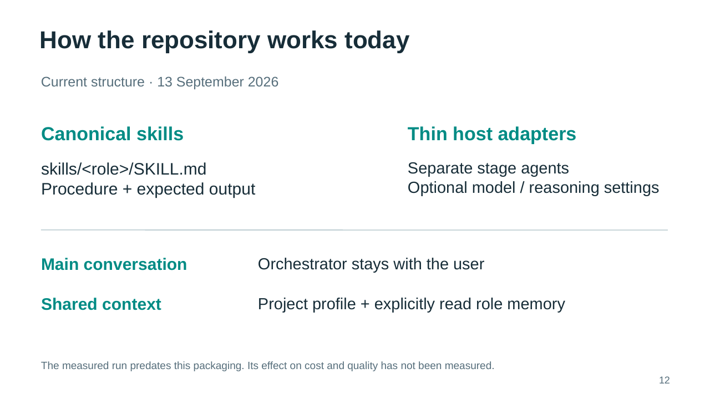

# English presentations for the Manychat meetup

All four versions target 18 minutes of content and a 2-minute buffer. Audience questions follow the talk. The decks use the saved GitHub screenshots. Text, tables and process diagrams remain editable in PowerPoint. Screenshots are embedded and use native slide cropping.

The first two decks contain 11 slides each: an unnumbered title followed by 10 numbered content slides. The graph walkthrough contains 17 pages: a title, 10 content slides with separate builds for 6a–6c and 8a–8c, and two reference slides for questions. The builds share their original slide's timing. The main talk ends on content slide 10, PDF page 15.

The practical workflow has 16 pages: 14 main slides including the title, followed by two backup slides. Pages 1–16 match the scenario, PDF and speaker notes. The main talk ends on page 14.

| Version | PowerPoint | PDF | Speaker notes |
|---|---|---|---|
| Detailed case study | [PPTX](manychat-case-study-en.pptx) | [PDF](manychat-case-study-en.pdf) | [English notes](manychat-case-study-en-speaker-notes.md) |
| Theory and practice | [PPTX](manychat-theory-and-practice-en.pptx) | [PDF](manychat-theory-and-practice-en.pdf) | [English notes](manychat-theory-and-practice-en-speaker-notes.md) |
| Graph walkthrough | [PPTX](manychat-graph-walkthrough-en.pptx) | [PDF](manychat-graph-walkthrough-en.pdf) | [English notes](manychat-graph-walkthrough-en-speaker-notes.md) |
| Practical workflow | [PPTX](manychat-practical-workflow-en.pptx) | [PDF](manychat-practical-workflow-en.pdf) | [English notes](manychat-practical-workflow-en-speaker-notes.md) |

The PowerPoint files contain the same speaker notes, timing cues and source references. PDFs contain the audience slides only. All screenshots work offline. Links to the original TrafficRulesApp sources require access to the private repository.

## Rehearsal checkpoints

| Version | Checkpoints |
|---|---|
| Detailed case study | 1:00 agent loop; 6:00 test-coverage case; 12:00 costs; 17:00 closing |
| Theory and practice | 7:00 personal pipeline; 9:00 test-coverage case; 13:00 costs; 17:00 closing |
| Graph walkthrough | 2:30 full map; 7:30 PR #198; 12:00 QA fixes; 14:00 costs; 16:00 closing |
| Practical workflow | 2:00 compact map; 5:00 PR #198; 9:00 assertion mechanism; 12:30 cost; 14:00 current skills; 17:00 closing |

Allow about 10–15 seconds for the title within the opening minute. The original three versions keep their content-slide numbers. The fourth uses actual page numbers, including the title.

These are planned timings. Rehearse aloud with the slide changes before presenting. Preserve the two-minute buffer.

The example with 500 seconds illustrates the failure mechanism. It is not a measured result from the run. Cost figures exclude orchestrator tokens. In the practical workflow, 1 h 31 min is labeled as summed stage time. The main pull request remained open when the screenshots were captured on 6 September 2026. Recheck its status before the meetup.

## Plans and evidence

- [Detailed case-study plan](../manychat-meetup-agent-orchestration-talk.md)
- [Theory-and-practice plan](../manychat-meetup-agent-orchestration-talk-theory-and-practice.md)
- [Graph walkthrough plan](../manychat-meetup-agent-orchestration-talk-graph-walkthrough.md)
- [Practical-workflow plan](../manychat-meetup-agent-orchestration-talk-practical.md)
- [Screenshot catalog](../screenshots/README.md)
- [Local source copies](../resources/trafficrulesapp/README.md)

