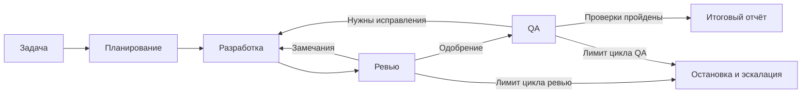

# Митап для Manychat — Эволюция пайплайна AI-разработки в TrafficRulesApp

> **Презентация на английском:** [PowerPoint](decks/manychat-case-study-en.pptx) · [PDF](decks/manychat-case-study-en.pdf) · [Заметки выступающего](decks/manychat-case-study-en-speaker-notes.md).

> [!info] Формат
> План и текст выступления: **18 минут содержания + 2 минуты запаса**. Вопросы аудитории — после доклада, вне лимита 20 минут.

> **Статус:** сценарий переработан под 20 минут; [кадры демонстрации подготовлены](screenshots/README.md). До выступления нужна репетиция с таймером. Указанные интервалы — план, а не результат замера речи.

> **Материалы:** [Исходные заметки](resources/manychat-meetup-agent-orchestration.md) — рабочие заметки; [Интервью Вадима Бриллиантова](resources/transcripts/ai-agents-harness.md) — интервью Вадима Бриллиантова. Примеры из личного проекта и цифры привязаны к источникам ниже.

> [!abstract] Главная мысль
> Пайплайн стоит настраивать по результатам реальных прогонов. Проверяемый результат нужен каждому этапу — в том числе самим проверкам и исправлениям. Покажу, как менялся мой процесс и что видно в его отчётах.

> **Титульный слайд:** перед десятью содержательными слайдами добавлен ненумерованный слайд «Agent Orchestration», Sergei Telegin и ссылка на GitHub. Всего в презентации 11 слайдов. На представление — 10–15 секунд внутри первой минуты; номера содержательных слайдов ниже сохранены.

## Структура и тайминг

| Интервал | Блок | Слайды | Что видит аудитория |
|---|---|---|---|
| 0:00–1:00 | 1. Предыстория: PR #143 | 1 | Ранний прогон: QA находит ошибку после ревью |
| 1:00–3:00 | 2. Модель, инструменты и harness | 2 | Простой цикл работы агента |
| 3:00–6:00 | 3. Роли и изменение процесса | 3–4 | Схема пайплайна и добавленное ревью QA-фиксов |
| 6:00–12:00 | 4. Основной кейс: PR #198 | 5–7 | Зелёные тесты → блокировка QA → фикс → ревью → повторный QA |
| 12:00–14:00 | 5. Результат и затраты PR #198 | 8 | Стоимость того же прогона, который только что разобрали |
| 14:00–17:00 | 6. Что ещё требует настройки | 9 | Профиль проекта, качество свидетельств, ограничения промптов |
| 17:00–18:00 | 7. Что применить у себя | 10 | Практический вывод и ссылка на репозиторий |
| 18:00–20:00 | Запас | — | Паузы, пояснения, переключения |

**Контрольные точки:** к 1-й минуте закончена предыстория #143; на 6-й уже открыт #198; на 12-й кейс завершён; на 17-й начинается заключение. Запас не заполнять дополнительной темой заранее.

---

## 1. Предыстория: PR #143 — 0:00–1:00

**Слайд 1: «Ранний прогон: QA нашёл ошибку после ревью»**

Показать одобрение PR #143 и заголовок issue #144. На слайде — июль 2026 года. Это короткая предыстория; полный разбор таймера в основной доклад не включать. Источник: S1.

### Что сказать

У меня есть личный проект TrafficRulesApp — iOS-приложение для подготовки к испанскому экзамену по правилам дорожного движения. Часть задач разработки я провожу через команду AI-агентов.

В июле агенты добавляли накопительную статистику. Reviewer одобрил изменение, а QA затем нашёл двойной учёт времени: таймер завершал тест под открытым диалогом выхода, после чего подтверждение выхода повторно начисляло время.

С тех пор я менял и настраивал пайплайн. Сегодня покажу одну подтверждённую поправку в его правилах и более поздний прогон: там уже все 157 тестов проходили, но QA всё равно заблокировал работу.

Разберём, что именно он нашёл, зачем понадобилось ревью исправлений и сколько стоил этот прогон. Сначала коротко о том, кто управляет работой агентов.

---

## 2. Модель, инструменты и harness — 1:00–3:00

**Слайд 2: «Как выполняется задача агента»**

Схема: задача → модель → вызов инструмента → результат инструмента → модель. Вокруг цикла — среда исполнения: контекст, доступные действия, обработка ошибок и остановка.

### Что сказать

Для этого разговора достаточно трёх компонентов. Модель обрабатывает контекст, предлагает следующий шаг и может запросить инструмент. Инструмент читает файл, выполняет команду или обращается к внешней системе.

Среда исполнения, или harness, связывает эти действия. Она передаёт модели результаты инструментов, управляет контекстом и разрешениями, обрабатывает ошибки и определяет, как продолжить или остановить работу.

Выбор следующего шага тоже может быть отдан модели. Поэтому наличие harness ещё не означает, что весь маршрут задачи заранее прописан в коде. Степень свободы зависит от конкретной реализации.

Например, модель может сама решить, какие файлы читать и какую реализацию попробовать. При этом проверку сборки можно сделать обязательным условием завершения задачи — если исполнитель действительно контролирует это условие.

Когда агентов несколько, появляется отдельный вопрос: кто передаёт работу между ними? В моём процессе это агент-оркестратор. Он получает исходную задачу, запускает роли и собирает результаты.

Здесь полезно различать два уровня. Можно написать в промпте: «всегда запускай тесты». А можно программно запретить следующий этап, пока результат тестов не получен. У этих решений разные гарантии.

Мой опубликованный проект в основном описывает первый уровень: инструкции ролей и порядок их работы. Эту границу важно помнить, когда мы будем смотреть на схему процесса.

---

## 3. Роли и изменение процесса — 3:00–6:00

**Слайд 3: «Роли и результаты этапов»**

| Роль | Задача | Что передаёт дальше |
|---|---|---|
| Task planner | Определить состав работ и критерии | Issues с проверяемыми требованиями |
| Developer | Реализовать изменение | PR, описание изменений, результаты проверок |
| Code reviewer | Проверить изменение и его связи с остальным кодом | Замечания или явное одобрение |
| QA tester | Проверить критерии и сценарии поведения | Баги, результаты проверок, вердикт |
| Orchestrator | Передавать контекст и управлять этапами | Собранный результат всего прогона |

### Что сказать

Planner превращает пожелание в требования, которые можно проверить. Developer читает их, меняет код и открывает PR. Reviewer получает исходную задачу и реальное изменение, проверяет реализацию и возвращает замечания либо одобрение.

QA получает отдельное поручение: проверить критерии и поискать проблемные сценарии. Акценты отличаются, хотя области ответственности пересекаются.

Оркестратор передаёт между ролями задачу, контекст, issues, PR и результаты предыдущих проверок.

Промпты и порядок работы со временем менялись. Сопоставлять ранний прогон с сегодняшними инструкциями напрямую нельзя. Но отдельные изменения процесса можно проследить по коммитам и отчётам.

**Слайд 4: «Исправления после QA тоже проходят ревью»**



Подсветить маршрут QA → разработка → ревью → QA. Под схемой — дата 26 августа и короткий фрагмент добавленного правила 11 из коммита `47fe491`. Источники: S2 и S10.

> Схема показывает описанные правила процесса, а не точный стейт каждого исторического запуска. Mermaid не исполняет переходы; их соблюдение поручено оркестратору. Уборка Git и issues на слайде скрыта.

26 августа в инструкции оркестратора было явно добавлено правило: после исправления QA-замечаний снова вызвать reviewer, и только после его одобрения возвращаться на QA. Вот этот добавленный переход в Git.

Это закрывает понятный пробел: исправление само меняет код и тоже может содержать ошибку. Одобрение предыдущей версии не покрывает новые изменения автоматически.

В текущем процессе для каждого цикла исправлений установлен предел — три итерации. Если работа не сходится, оркестратор должен остановиться и передать человеку список блокеров.

В переносимой версии общие роли отделены от профиля проекта. В профиле лежат стек, команды проверок и архитектурные ограничения. В основном кейсе мы увидим и такой профиль, и явно записанное ревью QA-фиксов.

Я показываю эволюцию по сохранённым свидетельствам. Полный контекст старых сессий не восстановлен, поэтому это не эксперимент с двумя воспроизведёнными конфигурациями. Теперь перейдём к сентябрьскому PR #198.

---

## 4. Основной кейс: PR #198 — 6:00–12:00

> [!note] Формат демонстрации
> Подготовленный разбор прогона по исходным комментариям PR и изменениям тестов. Основная история — связанные находки #199 и #200. Третью находку #201 и детали Xcode оставить для вопросов.

### 4.1. Задача и зелёные проверки — 6:00–7:30

**Слайд 5: «157 тестов прошли. QA заблокировал PR»**

Показать краткую цель PR #198, `APPROVAL` из второго ревью, затем таблицу зелёных тестов и `BLOCKED` из первого QA-отчёта. Источники: S3–S5.

### Что сказать

Следующая задача — добавить unit-тесты для ProgressStore и записи прогресса из тестовой сессии. В том числе проверить защиту от повторного начисления времени после завершения — ту самую историю из июльского PR.

Менять код приложения в этой задаче не требовалось. Нужно было добавить проверки существующего поведения. Итог — 32 новых теста, а полный набор вырос со 125 до 157.

На первом ревью появились замечания, разработчик их исправил. Второе ревью одобрило результат. В отчёте QA тоже все тесты зелёные: разные устройства, полный набор и отдельный запуск новых классов.

Но вердикт QA — BLOCKED. Найдены три проблемы в самих тестах. Разберу две связанные: что именно утверждал тест и откуда в его хранилище могли взяться старые значения.

Здесь полезно разделить два утверждения: тест успешно выполнился, и тест действительно проверяет то поведение, ради которого написан. Первое ещё не доказывает второе.

### 4.2. Что проверял зелёный тест — 7:30–10:00

**Слайд 6: «Накопленное значение или вклад конкретного вызова»**

Показать одну упрощённую иллюстрацию. Число 500 — учебный пример загрязнённого состояния, а не измеренное значение конкретного QA-запуска. Источник механизма: S5, issue #199.

```swift
let before = 500.0
let after = 500.0   // проверяемый вызов ничего не добавил

after > 0          // true: старое накопленное время скрывает ошибку
after > before     // false: вклад этого вызова отсутствует
```

Затем раскрыть вторую часть: общее хранилище → отдельное хранилище для каждого теста. Это связанное исправление #200, без которого объяснение неполно.

### Что сказать

Пять тестов проверяли, что накопленное время после завершения сессии больше нуля. Но критерий был про вклад конкретного вызова: именно этот путь завершения должен добавить время.

Представим, что в хранилище уже было 500 секунд. Вызываем проверяемый метод, а он ничего не начисляет. Итог всё равно больше нуля. Тест проходит, хотя требуемое действие не произошло.

Сравнение со снимком до вызова проверяет другое: увеличилось ли значение после этого действия. В нашем примере 500 больше нуля, но 500 не больше 500.

В отчёте QA это связано с реальным риском изоляции. Тесты использовали общее UserDefaults.standard и вручную очищали список ключей. Состояние могло приходить из других тестов или сохраняться между запусками.

Поэтому исправление состояло из двух частей. В assertions добавили сравнение с предыдущим значением. А каждому тесту дали отдельное временное хранилище, передаваемое в объекты через уже существующие параметры.

Это две стороны одной проблемы: проверять вклад нужного действия и контролировать начальные условия проверки. Production-код для этого менять не пришлось.

Важно, что речь о пяти конкретных тестах. Нельзя сделать из этой находки вывод, будто все 157 зелёных тестов были бесполезны. QA как раз отдельно отметил проверки, которые были сделаны корректно.

Дальше исправление пошло через новый проход ревью. И reviewer уточнил, какой именно вывод можно делать из полученного результата.

### 4.3. Ревью исправления и повторный QA — 10:00–12:00

**Слайд 7: «Исправление → ревью → повторный QA»**

Показать коммит `114cb54`, заголовок третьего ревью с прямой ссылкой на правило 11, затем `QA — Pass 2: GREEN`. Источники: S6–S7.

Цепочка артефактов: review 1 → исправления → review 2 → QA BLOCKED → QA-фиксы → review 3 → QA GREEN. Заголовки отчётов важнее полного текста.

### Что сказать

Третий отчёт ревью прямо ссылается на правило 11: изменения после начала QA должны пройти review. Его предмет — именно QA-фиксы, и это видно по указанному диапазону коммитов.

Reviewer проверил отдельные хранилища и усиленные assertions. Но также уточнил обоснование: после исправления изоляции начальное значение в этих тестах равно нулю. Теперь сравнения с нулём и с before численно совпадают.

Поэтому неправильно приписывать весь эффект одной замене assertion. Она точнее выражает требование и полезна при других начальных состояниях, а здесь работает вместе с исправлением изоляции.

Вот для чего полезен этот проход. Reviewer проверяет не только форму исправления, но и то, что действительно доказали приведённые проверки. Это содержательный результат дополнительного этапа.

В повторном QA есть GREEN, разбор всех трёх находок и отчёт о 157 проходящих тестах. В частности, там описана проверка с намеренно загрязнённым общим хранилищем при изолированных новых тестах.

В отличие от раннего примера, здесь вся цепочка повторных проверок явно представлена в комментариях. Можно проследить, какие замечания привели к изменениям и что проверили после них.

Результат этого прогона — PR с одобренными изменениями и зелёным QA. Решение о merge остаётся отдельным. Теперь посмотрим на затраты того же самого прогона.

> **Статус при подготовке:** PR #198 открыт, `mergedAt = null`. Перед выступлением проверить статус снова. Комментарии — отчёты агентов; не приписывать им просмотренные отдельно логи или точное восстановление сессии.

---

## 5. Результат и затраты PR #198 — 12:00–14:00

**Слайд 8: «Сколько стоил этот прогон»**

Основные числа — по сохранённому отчёту именно задачи ProgressStore tests, разобранной в PR #198. Источник: S8. Историческую выборку из 20 запусков в этот слайд не включать.

| Показатель | По отчёту прогона |
|---|---|
| Запуски подагентов | 9 |
| Время | Около 1 ч 31 мин |
| Токены подагентов | 1 097 667, около 1,10 млн |

Под таблицей: 32 новых теста; код приложения не менялся. В PR также добавлен профиль проекта. Токены оркестратора не входят в измеренную цифру.

### Что сказать

У этого прогона сохранён отчёт о затратах: девять запусков подагентов, около полутора часов и примерно 1,10 миллиона обработанных ими токенов. Это относится к только что показанной задаче.

Три запуска reviewer, три developer, два QA и один planner. Возвраты на исправление хорошо видны и в этой разбивке, и в истории отчётов PR.

Токены оркестратора в измеренную цифру не входят. Время берётся из отчёта прогона, а не из интервалов между публикацией GitHub-комментариев. Комментарии могли публиковаться уже после выполнения работы.

Стоимость в деньгах зависит от входных и выходных токенов, модели и кэша. В сохранённом отчёте она оценочная. Поэтому я показываю измеренные затраты, а не выдаю расчётную сумму за счёт от провайдера.

Для задачи на 32 теста это заметные накладные расходы. При этом процесс поймал проблемы своих же тестов и оставил объяснение исправлений. Эти две стороны нужно оценивать вместе.

Из этого прогона нельзя заключить, что несколько агентов дешевле или качественнее одного: сопоставимого контрольного запуска нет. Но можно увидеть, на что ушли ресурсы и какие находки принесли дополнительные этапы.

Для следующих задач я бы сохранял ещё и время вмешательства человека. Оно нужно, чтобы понять, действительно ли такой процесс разгружает разработчика, а не только переносит его работу в чтение отчётов.

---

## 6. Что ещё требует настройки — 14:00–17:00

**Слайд 9: «Что я меняю в процессе»**

| Наблюдение | Ответ в процессе |
|---|---|
| QA-фиксы тоже меняют код | Отдельное ревью до повторного QA |
| Сведения о проекте устаревают | Один профиль и отчёты о расхождениях |
| Вердикт зависит от качества свидетельств | Сценарии, версии и результаты проверок в отчётах |
| Переходы пока задаются промптами | Возможное усиление: контроль исполнителем |

### Что сказать

Первое изменение мы уже увидели: отдельная проверка QA-фиксов. Второе связано с контекстом проекта. В переносимой версии общие роли отделены от профиля с командами, архитектурой и ограничениями конкретного приложения.

Такой профиль добавлен в PR #198. Во время прогона агенты сообщили о нескольких расхождениях: числе вопросов, числе тестовых файлов и способе подсчёта результатов. Исправления внесли в профиль.

Особенно показателен подсчёт тестов. Из-за перемешанных строк параллельного вывода grep давал 156, хотя выполненных тестов было 157. В отчётах в качестве источника результата использовали структурированную сводку xcresult.

Это пример настройки процесса по наблюдению. Нужно исправить не только неверное число в одном сообщении, но и способ, которым следующий агент будет получать это число.

Но сам профиль тоже может устареть. А проверяющие могут неправильно понять результат. Поэтому важно сохранять конкретные свидетельства: что проверили, на какой версии и как получили вывод.

Отдельная граница — исполнение правил. В моём репозитории они в основном записаны текстом. Оркестратор должен прочитать их, интерпретировать и выполнить. Mermaid-схема сама не запрещает пропустить этап.

Программно проверять допустимость переходов, лимиты и наличие результатов тестов — возможное усиление. Чекпоинты и автоматическое восстановление текущий набор промптов сам по себе не реализует.

Ещё одна граница — координация. Новый агент может заново исследовать уже изученный код. Слишком мелкое разбиение увеличивает число передач работы и повторных чтений. Эти затраты были видны в нашем прогоне.

Поэтому я бы не закреплял один сложный процесс для всех задач. Для небольшой правки может хватить одного агента и подходящих тестов. Для более сложной задачи дополнительные этапы могут оправдать свои затраты.

История этих PR показывает изменение правил и результатов проверки. Она не измеряет, насколько одна версия пайплайна лучше другой: для этого нужны сопоставимые задачи и сохранённые условия запуска.

---

## 7. Что применить у себя — 17:00–18:00

**Слайд 10: «Настраивать процесс по результатам прогонов»**

На слайде: результат → найденный пробел → изменение правила → следующий прогон. Рядом — ссылка или QR на [agent-orchestration](https://github.com/TeleginS/agent-orchestration).

### Что сказать

Если пробовать такой подход у себя, я бы начал с одного типа задач и понятных результатов этапов. Затем сохранял бы отчёты и разбирал, какие проверки дали полезные находки, а какие добавили только затраты.

В раннем примере QA нашёл ошибку после одобрения. Позже в правилах появилось обязательное ревью QA-фиксов. В более позднем прогоне уже можно проследить этот этап и то, как он проверяет обоснование исправления.

Для меня это и есть полезная эволюция пайплайна: менять процесс на основании наблюдений и проверять, что изменилось в следующем прогоне. Проверяемый результат нужен и коду, и самим проверкам.

Репозиторий с ролями, профилями и примерами доступен по ссылке. Спасибо — готов обсудить вопросы.

---

## Подготовка демонстрации

Этот раздел — заметки выступающего, не дополнительные слайды основного доклада.

[Каталог готовых скриншотов](screenshots/README.md) содержит соответствие слайдам; [галерея](screenshots/index.html) позволяет выбрать и открыть кадры. Снимки сделаны с оригинальных страниц GitHub 6 сентября 2026 года.

- Для #143 сохранить только одобрение и заголовок бага #144. Уложить предысторию в минуту; не запускать приложение и не разворачивать отдельный разбор таймера.
- Для перехода к новой версии сохранить diff `47fe491` с добавленным правилом 11. На слайде подписать дату и имя изменённого файла `.claude/agents/ai-orchestrator.md`.
- Для #198 сохранить фрагменты пяти отчётов: review 1, review 2, QA BLOCKED, review 3, QA GREEN. Основной показ — связка #199/#200; #201 оставить в запасе.
- Иллюстрацию `500 → 500` подписать как условный пример. Объяснять assertions вместе с изоляцией; сохранить уточнение reviewer о `before == 0` после исправления изоляции.
- Подготовить слайды для показа без сети и авторизации. Полные GitHub-страницы открывать только как дополнение: длинный отчёт не помещается на экран и тратит время на прокрутку.
- Проверить статус #198 перед выступлением. Пока подтверждён результат review/QA; на момент подготовки PR открыт. Не называть его слитым, пока merge не подтверждён.
- В блоке затрат использовать отчёт того же прогона #198. Не вычислять длительность этапов из времени публикации комментариев: отчёты могли быть выложены после работы.
- Прогнать выступление с переключениями: #198 открыт к 6-й минуте, кейс закончен к 12-й, заключение начинается к 17-й. При отставании сократить дополнительные замечания, а не основной механизм находки.

## Как показывать эволюцию без полного стейта

| Опора | Что можно утверждать |
|---|---|
| Июльский PR #143 | Есть первоначальное одобрение, QA-баг и исправление |
| Коммит `47fe491` от 26 августа | В версионируемые инструкции добавлено ревью QA-фиксов и правило 11 |
| Сентябрьский PR #198 | В отчётах явно видны review QA-фиксов, повторный QA и профиль проекта |

Этих свидетельств достаточно для истории изменения процесса. Они не восстанавливают полный контекст исполнения: могли влиять незакоммиченные промпты, инструкции основной сессии, модель и настройки.

Не утверждать, что #143 был единственной причиной добавления правила 11, если это не подтверждается отдельным свидетельством или воспоминанием выступающего. Отсутствие отчёта в PR само по себе не доказывает отсутствие этапа.

Если понадобится более подробная история, сопоставлять изменения файлов агентов с датами PR. Результат называть реконструкцией версионируемых инструкций, а не точным воспроизведением состояния прошлой сессии.

## Источники и границы выводов

PR, issues и изменения TrafficRulesApp сохранены локально. В копиях есть ссылки на оригиналы; для оригиналов нужен доступ к приватному репозиторию.

**S1. Предыстория.** [PR #143](resources/trafficrulesapp/pr-143.md), [одобрение](resources/trafficrulesapp/pr-143.md#issuecomment-4886098768), [QA-баг #144](resources/trafficrulesapp/issue-144.md).

**S2. Изменение правила.** [Коммит 47fe491 от 26 августа](resources/trafficrulesapp/commit-47fe491.md) добавляет reviewer между QA-фиксом и повторным QA, а также правило 11.

**S3. Основной кейс.** [PR #198 — Unit test coverage for ProgressStore](resources/trafficrulesapp/pr-198.md): задача, итоговое изменение, результаты проверок и описание профиля проекта.

**S4. Первые два ревью.** [Iteration 1](resources/trafficrulesapp/pr-198.md#issuecomment-5500796064) — условное одобрение с замечаниями; [iteration 2](resources/trafficrulesapp/pr-198.md#issuecomment-5500799535) — одобрение исправлений.

**S5. QA-блокировка.** [QA Pass 1](resources/trafficrulesapp/pr-198.md#issuecomment-5500803440), [#199: assertions](resources/trafficrulesapp/issue-199.md), [#200: изоляция](resources/trafficrulesapp/issue-200.md).

**S6. QA-фиксы и их ревью.** [Коммит 114cb54](resources/trafficrulesapp/commit-114cb54.md), [review iteration 3](resources/trafficrulesapp/pr-198.md#issuecomment-5500807469). Здесь же — уточнение о начальном нуле.

**S7. Повторный QA.** [QA Pass 2 — GREEN](resources/trafficrulesapp/pr-198.md#issuecomment-5500811713). Это отчёт агента о проверках, а не заново выполненная при подготовке доклада тестовая сессия.

**S8. Затраты основного кейса.** [Отчёт ProgressStore tests](https://github.com/TeleginS/agent-orchestration/blob/693c5cd291e35d773c9f68f99888ca420dbbf30a/examples/run-progress-store-tests/README.md). Измерения подагентов отделены от оценок оркестратора и цены.

**S9. Профиль проекта.** [Коммит 9a26da8](resources/trafficrulesapp/commit-9a26da8.md) добавляет `.claude/project-profile.md`; описание в PR и отчёты перечисляют выявленные расхождения.

**S10. Опубликованные правила.** [PIPELINE.md](https://github.com/TeleginS/agent-orchestration/blob/693c5cd291e35d773c9f68f99888ca420dbbf30a/PIPELINE.md), [generic harness](https://github.com/TeleginS/agent-orchestration/blob/693c5cd291e35d773c9f68f99888ca420dbbf30a/adapters/generic-harness/README.md).

**S11. Дополнительная историческая выборка.** [Сводка 20 запусков](https://github.com/TeleginS/agent-orchestration/blob/693c5cd291e35d773c9f68f99888ca420dbbf30a/examples/README.md). В основной слайд затрат не входит; это предшественник, а не 20 прогонов новой версии.

**S12. Теоретический фон.** [Building effective agents, Anthropic](https://www.anthropic.com/engineering/building-effective-agents) и [интервью Вадима Бриллиантова](resources/transcripts/ai-agents-harness.md). Чужие кейсы не включены в личный опыт выступающего.

## Дополнительные материалы для вопросов

В основной хронометраж не входят. GOAP, DSPy и обзор протоколов остаются в [рабочих заметках](resources/manychat-meetup-agent-orchestration.md).

**Что ещё нашёл QA в #198?** [Issue #201](resources/trafficrulesapp/issue-201.md): тесты двух ветвей выхода не проверяли различие в сохранении результата. Детали — в QA Pass 1 и review iteration 3.

**Что показывают 20 запусков?** По исторической сводке reviewer возвращал работу в 2 запусках, QA заводил баги в 8. Это наблюдения на одном проекте, не сравнение версий и не измерение полноты обнаружения ошибок.

**Что с чекпоинтами?** Нужны исполнитель и сохраняемое состояние. Повтор незавершённого шага может повторить запись или запрос; его побочные эффекты требуют отдельной обработки.

Пример реализации: [LangGraph Functional API — Idempotency](https://docs.langchain.com/oss/python/langgraph/functional-api#idempotency). Такие возможности нельзя приписывать одной Mermaid-схеме или набору промптов.

**Почему не один агент?** Нужны сопоставимые прогоны. Показанный кейс подтверждает находки дополнительных этапов, но не измеряет преимущество над другими конфигурациями.

**Почему не бесконечные исправления?** В текущем процессе предел каждого цикла исправлений — три итерации, затем остановка и эскалация. Общий лимит всех повторных запусков требует отдельного контроля.

**Что с вероятностями ошибок?** Для независимых шагов с вероятностью успеха 0,95 каждый, без исправления ошибок, вероятность успеха десяти шагов равна `0.95^10 ≈ 59.9%`.

При независимых попытках вероятность хотя бы одной ошибки равна `1 − (1 − p)^N`. Это условные математические иллюстрации, а не измеренные характеристики этого пайплайна или прогноз ухода пользователей.
