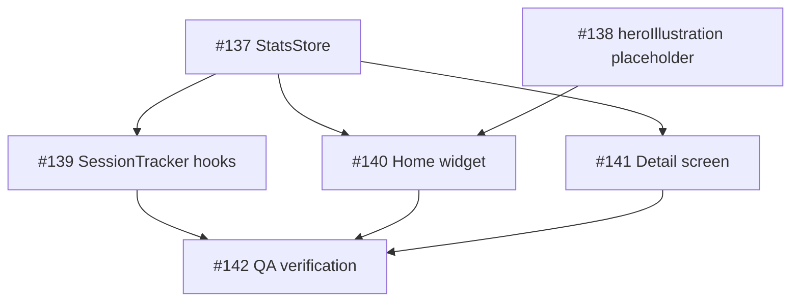

# Step 1 — Epic issue #136

Produced by `task-planner`. Labels: `epic`, `epic:cumulative-stats`.

The section that matters most is **Locked domain model**: downstream agents treat it as
settled law. The developer does not relitigate it, the reviewer checks against it, and QA
tests it. Every disagreement about what "completed" means was had *before* this issue
existed, during the design pass that produced ADR-0008.

Note the **Risks** section. It names time double-counting as the top risk and assigns
verification to the QA child issue. Keep that in mind while reading `04-code-review.md`.

---

## [Epic] Redesign the home statistics widget — cumulative Stats

### Goal

Replace the home "Today's progress" widget with a cumulative, all-time **Stats** widget
plus a per-category detail screen. Metrics stop resetting at midnight and honestly reflect
the user's whole history.

Sources of truth (decided, not reopened): `docs/adr/0008-cumulative-stats.md` and the
`CONTEXT.md` glossary (terms *Completed* / *Closed* / *Stats* / *Consistency rate*).

### What we are building

**Widget** (hero illustration on top, whole card tappable → pushes the detail screen):

- Habits: `completed / 240` + mini progress bar
- Categories: `closed / 6` + mini progress bar
- Time: all-time focus total (adaptive `Xh Ym` / `Xm`)
- Consistency: all-time rate `%`

**Detail screen** "My stats": nav title + subtitle; a plain list of the 6 categories, each
showing name + `completed/total` (green/gray) + a progress bar. Rows are read-only — no
navigation, no gating.

### Locked domain model

- **Completed** = checked in successfully at least once, in any flow. Monotonic — never
  becomes un-completed.
- **Closed category** = every habit in it completed. Denominator is 6.
- **Consistency** = `completedCheckIns / totalCheckIns × 100`, all-time, every check-in
  counts.
- **Total time** = Σ of focus-session durations across all flows including freeform,
  wall-clock (v1).
- **Freeform sessions** count toward completed + consistency + time.
- Start from zero, no backfill. "Clear history" resets everything, Stats included.

### Key technical constraints

- New `StatsStore` (`ViewModel`-scoped, `DataStore`-backed): `completedHabitIds: Set<Long>`,
  `completedCheckIns: Int`, `totalCheckIns: Int`, `totalFocusSeconds: Long`, `reset()`.
  Wired like the other stores: constructed in the app graph, injected via Hilt.
- Hook into `SessionTracker.submitCheckIn()`: every check-in increments `totalCheckIns`;
  on success also `completedCheckIns += 1` and `statsStore.markCompleted(id)` — symmetric
  with the existing `streakStore.markHit/markMiss`.
- Accumulate elapsed time on **all** terminal paths: `completeSession`, `timeExpired`,
  `exitSession` **and** `completeFreeform` (which currently persists nothing — a fixable
  bug), including the freeform-abandon early return inside `exitSession`.
- `SessionTracker.clearHistory()` must also call `statsStore.reset()`.
- Habit denominators and per-category totals come **only** from
  `HabitRepository.getHabitIds(for:)` / `totalHabitCount` (6 categories, 240 habits). Never
  from the static category manifest.
- The `heroIllustration` drawable does not exist — create it with a **temporary
  placeholder** so real art can be dropped in later with no code change.

### Localization contract

Add to all three `strings.xml` (`values`, `values-es`, `values-de`). Canonical key set;
each view task implements its own subset:

`stats.title`, `stats.subtitle`, `stats.habits`, `stats.categories`, `stats.time`,
`stats.consistency`, `stats.time.format.hm`, `stats.time.format.m`

Number and time formatting goes through locale-safe APIs — never hardcoded.

### Tasks

- [ ] `StatsStore` + wiring/injection — #137
- [ ] Capture hooks in `SessionTracker` (check-in counters, time on all paths, reset) — #139
- [ ] `heroIllustration` placeholder drawable — #138
- [ ] Home Stats widget (replaces "Today's progress") — #140
- [ ] Detail screen "My stats" (per-category list) — #141
- [ ] QA: time correctness, completed monotonicity, closed at full coverage, consistency,
      freeform time — #142

### Dependency graph

### Risks and open questions

- **Time double-counting on terminal paths**: `exitSession` has an early return for
  freeform-abandon — time must be added exactly once on each path. Risk runs both ways:
  a missed path and a double count. Verified in QA (#142).
- `completeFreeform` currently persists no time — fixing it is mandatory, otherwise
  freeform never contributes.
- `minSdk 26` compatibility for the widget → detail navigation: confirm the fallback on
  the minimum API level when implementing #140.
- The old today-scoped stats and their now-unused string keys are no longer displayed —
  whether to delete them is left to the widget PR (#140).

### Definition of done for the epic

- [ ] Widget shows 4 cumulative metrics, does not reset at midnight, whole card pushes the
      detail screen.
- [ ] "My stats" shows 6 categories with `completed/total` and a progress bar, read-only.
- [ ] Completed is monotonic; a category closes only at full coverage; consistency counts
      every check-in; time accumulates across all flows including freeform, exactly once.
